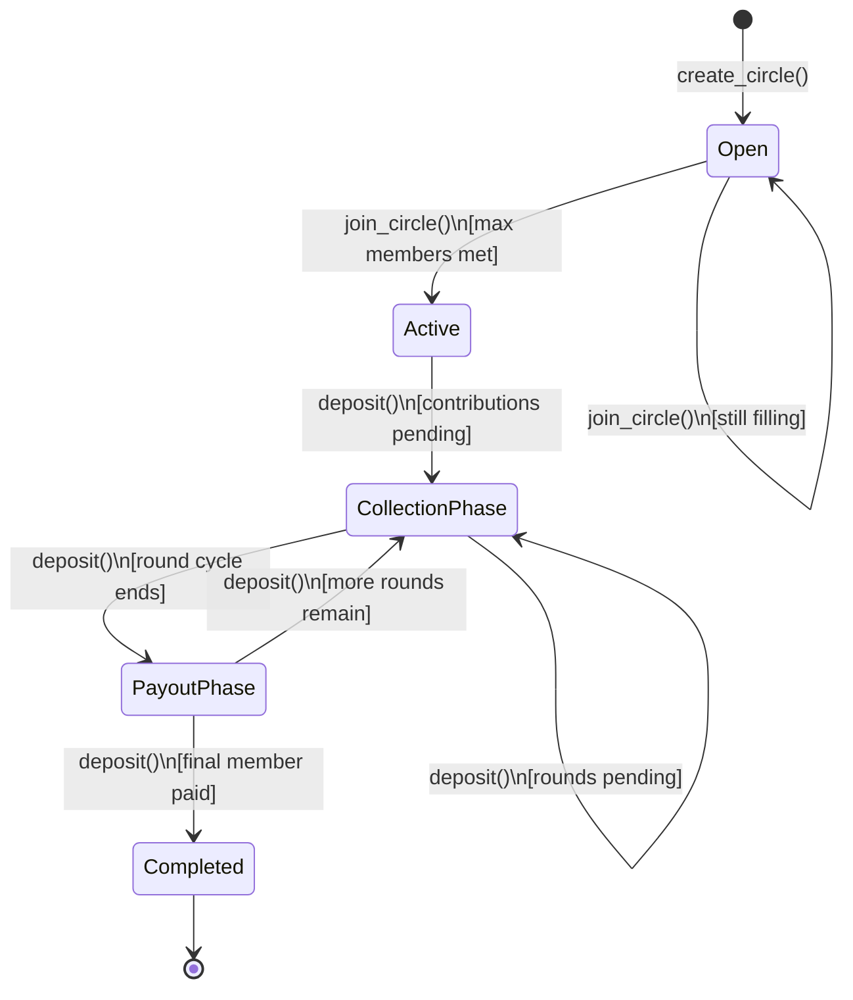

# SoroSusu: Decentralized Savings Circle
A trustless Rotating Savings and Credit Association (ROSCA) built on Stellar Soroban.

## Table of Contents
1. [Overview & Deployment](#overview--deployment)
2. [Protocol Overview](#protocol-overview)
3. [Savings Group Lifecycle](#savings-group-lifecycle)
4. [Public Function Signatures](#public-function-signatures)
5. [Core Features](#core-features)
    - [Flexible Shares](#flexible-shares)
    - [Path Payments](#path-payments)
    - [Buddy System & Trust Networks](#buddy-system--trust-networks)
    - [Audit Logging](#audit-logging)
6. [Risk Management & Security](#risk-management--security)
    - [Collateral & Slashing](#collateral--slashing)
    - [Guarantors & Social Vouching](#guarantors--social-vouching)
    - [Nuclear Option & Emergency Recovery](#nuclear-option--emergency-recovery)
    - [Rate Limiting](#rate-limiting)
7. [Governance & Voting](#governance--voting)
    - [Quadratic Voting](#quadratic-voting)
    - [Leniency Voting](#leniency-voting)
    - [Governance Token Mining](#governance-token-mining)
8. [Analytics & Reputation Engines](#analytics--reputation-engines)
    - [Credit Score Oracle](#credit-score-oracle)
    - [Group Resilience Rating](#group-resilience-rating)
    - [Source of Funds Verification](#source-of-funds-verification)
9. [Developer & Maintainer Guide](#developer--maintainer-guide)
10. [Testing & Verification](#testing--verification)

---

## Overview & Deployment
### Deployed Contract
- **Network:** Stellar Mainnet
- **Contract ID:** CAH65U2KXQ34G7AT7QMWP6WUFYWAV6RPJRSDOB4KID6TP3OORS3BQHCX

### Features
- Create savings circles with fixed contribution amounts
- Join existing circles with optimized state management
- Deposit USDC/XLM securely
- Automated payouts with randomized or fixed order
- Immutable audit log for sensitive actions
- Integrated Buddy System for social security

---

## Protocol Overview
### Randomized Payout Order
SoroSusu supports randomized payout queues to ensure fairness and prevent circular collusion.
- **Random Queue**: Uses Soroban's Pseudo-Random Number Generator (`env.prng().shuffle()`) to reorder member addresses.
- **Finalization**: Circle transition logic ensures the payout order is locked once the circle is active.

### Group Rollover (Multi-Cycle Savings)
The protocol allows circles to persist across multiple rounds without redeployment, resetting internal round counters while preserving the member list.

---

## Savings Group Lifecycle

The diagram below shows the full lifecycle of a savings group, from creation through to final payout.



### State Descriptions

| State | Description |
|---|---|
| **Open** | The circle has been created and is accepting new members. |
| **Active** | All required members have joined; the circle is confirmed and ready to begin rounds. |
| **Collection Phase** | Members are depositing their fixed contribution for the current round. |
| **Payout Phase** | Contributions for the round are complete; funds are disbursed to the recipient. |
| **Completed** | Every member has received a payout. |

---

## Public Function Signatures

### Initialization & Admin
#### `init(env: Env, admin: Address, global_fee: u32)`
Initializes the contract with a global administrator and a default penalty fee (in basis points).

### Circle Management
#### `create_circle(env: Env, creator: Address, amount: u64, max_members: u32, token: Address, cycle_duration: u64, bond_amount: u64) -> u64`
Creates a new savings circle with a mandatory bond deposit from the creator.

#### `join_circle(env: Env, user: Address, circle_id: u64)`
Adds a member to an existing circle.

### Operations
#### `deposit(env: Env, user: Address, circle_id: u64, rounds: u32)`
Batch deposit for one or more rounds.

#### `pair_with_member(env: Env, user: Address, buddy_address: Address)`
Sets a social buddy for security and recovery purposes.

#### `set_safety_deposit(env: Env, user: Address, circle_id: u64, amount: i128)`
Deposits collateral into a circle's safety buffer.

### SEP-24 Anchor Integration
#### `register_anchor(env: Env, admin: Address, anchor_address: Address, name: Symbol, sep_version: Symbol, kyc_required: bool, supported_tokens: Vec<Address>, max_deposit_amount: u64, daily_deposit_limit: u64)`
Registers a new SEP-24 anchor for fiat conversions.

#### `set_payout_preference(env: Env, user: Address, circle_id: u64, payout_method: PayoutMethod, anchor_config: Option<AnchorDepositConfig>)`
Sets user's payout preference for a circle (Direct Token vs Direct-to-Bank).

#### `get_payout_preference(env: Env, user: Address, circle_id: u64) -> UserBankPreference`
Retrieves user's payout preference for a circle.

#### `deposit_for_user(env: Env, anchor_address: Address, user_address: Address, circle_id: u64, amount: u64, token: Address, fiat_reference: Symbol)`
Deposits funds on behalf of a user via an anchor (for SEP-24 integration).

#### `process_anchor_payout(env: Env, anchor_address: Address, user_address: Address, circle_id: u64, amount: u64, token: Address) -> Result<u64, u32>`
Processes a payout to an anchor for fiat conversion.

---

## Core Features
### Flexible Shares
Members participate at different contribution levels (1x or 2x), with payouts adjusted according to their share weight.

### Path Payments
Enables members to contribute using any Stellar asset, automatically swapped to the circle's base currency via Soroban's native swap capabilities.

### SEP-24 Direct-to-Bank Payouts
- **Anchor Integration**: Users can choose to receive payouts as fiat currency directly to their bank accounts or mobile money wallets (e.g., M-Pesa).
- **Automatic Conversion**: Contract automatically routes payouts to designated SEP-24 anchors for crypto-to-fiat conversion.
- **Fallback Safety**: If anchor processing fails, system automatically falls back to direct token payouts.
- **KYC Support**: Optional KYC verification for enhanced security and compliance.
- **Mobile Money Support**: Supports popular mobile money providers across African markets.

### Buddy System & Trust Networks
- **Buddy Assignment**: Every member is paired with a "Buddy" responsible for social vouching.
- **Safety Fallback**: Safety deposits can cover a buddy's missed payment to prevent group default.

---

## Risk Management & Security
### Collateral & Slashing
- **Bond Staking**: Creators must stake a bond to disincentivize fraudulent circle creation.
- **Slashing**: Defaulting members can have their bond or safety deposits slashed by the admin.

### Nuclear Option & Emergency Recovery
- **Nuclear Option**: A majority-voted mechanism to halt operations and return funds in case of emergency.
- **Social Recovery**: Allows members to recover participation access via consensus from their designated buddies.

### Rate Limiting
A tiered cooldown system prevents spam joining or malicious circle creation within rapid succession.

---

## Governance & Voting
### Quadratic Voting
Reduces plutocracy by making subsequent votes exponentially more expensive (`Cost = Votes²`).

### Leniency Voting
A specialized voting mechanism to grant extensions to members in distress, preventing immediate penalties.

---

## Analytics & Reputation Engines
### Credit Score Oracle
Integrates on-chain and off-chain data to calculate a "DeFi Credit Score" based on contribution history.

### Reliability Index (RI) Whitepaper
Detailed technical documentation is available in `RELIABILITY_INDEX_WHITEPAPER.md`, explaining how the RI is calculated, how fees are discounted, and how inactivity decay and identity gating are enforced.

### Source of Funds Verification
Produces cryptographic proof of participation, enabling users to prove the legitimacy of savings to off-chain institutions.

---

## Developer & Maintainer Guide
### Build Instructions
```bash
cargo build --target wasm32-unknown-unknown --release
```

### Git Workflow
- **Protected Main**: Requires a passing integration test suite.
- **Audit Labels**: Logic changes require `audit-required` tags.

---

## Testing & Verification
### Scenario Testing
- **Hyper-Inflation**: Validates protocol against extreme volumes (1e27 stroops).
- **Graceful Exit**: Ensures members can exit circles midway if a replacement is found.
- **Liquidity Buffers**: Validates reputation-based advance requests for early payouts.
